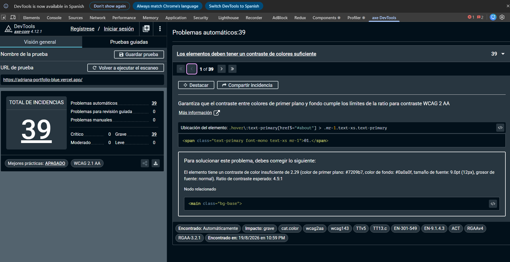

# Auditoría de accesibilidad con axe — 19 agosto 2026

Medición del estado de partida (tarjeta 0.2 de la Fase 0). **Este documento no
propone soluciones**: mide y describe lo que hay.

- URL medida: `https://adriana-portfolio-blue.vercel.app`
- Fecha de ejecución: **2026-08-19, 22:59** (hora local)
- Idioma de la interfaz durante el escaneo: **español**
- Rama: `docs/axe-baseline`
- Complementa: [`lighthouse-2026-08-19.md`](lighthouse-2026-08-19.md) · [`no-js-2026-08-18.md`](no-js-2026-08-18.md) · [`baseline-2026-08-11.md`](baseline-2026-08-11.md)

## ⚠️ Lo automático no equivale a conformidad

**Este informe documenta 39 problemas detectados automáticamente. No dice que el
sitio sea accesible, ni que deje de serlo al corregirlos.**

Las herramientas automáticas cubren aproximadamente **un tercio** de los
criterios WCAG. El resto exige juicio humano: si un `alt` describe de verdad la
imagen, si el orden del foco tiene sentido, si el sitio es usable con lector de
pantalla. Nada de eso se ha probado aquí.

El apartado 5 contiene tres fallos reales de accesibilidad de este sitio que
**ninguna herramienta automática detecta**, y uno de ellos axe lo da por bueno
explícitamente.

## Herramientas y versiones

| Herramienta | Versión |
|---|---|
| axe DevTools (extensión de Chrome) | motor **axe-core 4.12.1** |
| Google Chrome | 151.0.7922.138 |
| Configuración | filtro **WCAG 2.1 AA**, «Mejores prácticas» **desactivado** |

### Incidencia: el CLI no se pudo usar

`npx @axe-core/cli` falló por desfase de versiones:

```
Error: session not created: This version of ChromeDriver only supports Chrome version 152
Current browser version is 151.0.7922.138
```

ChromeDriver debe coincidir en versión mayor con el Chrome instalado, y `npx`
descarga siempre el más reciente. **Se descartó el CLI y se usó la extensión, que
ejecuta el mismo motor de reglas.** No se actualizó Chrome a propósito: hacerlo
habría cambiado el entorno de medición a mitad de la Fase 0, cuando los informes
del 18 y 19 de agosto ya declaran Chrome 151.

### Segunda ejecución de contraste

La exportación de resultados de la extensión es una función de pago, así que el
desglose del apartado 3 procede de una **segunda ejecución con axe-core 4.12.1
cargado por script** sobre la misma URL y con el mismo filtro de etiquetas
(`wcag2a`, `wcag2aa`, `wcag21a`, `wcag21aa`).

**Las dos ejecuciones coinciden exactamente**: 39 nodos, una sola regla,
severidad grave. Que dos vías independientes den el mismo resultado es, en sí
mismo, una validación de la medición.

---

## 1. Resumen

| Severidad | Incidencias |
|---|---:|
| Crítico | 0 |
| **Grave** | **39** |
| Moderado | 0 |
| Leve | 0 |
| **Total automático** | **39** |
| Problemas para revisión guiada | 0 |
| Problemas manuales | 0 |

---

## 2. Las 39 incidencias son **una sola regla**

| Regla | Criterio WCAG | Nivel | Impacto | Nodos |
|---|---|---|---|---:|
| `color-contrast` | **1.4.3** Contraste (mínimo) | AA | grave | **39** |

No hay 39 problemas distintos. Hay **una decisión de diseño repetida 39 veces**.

Y no se publica aquí una tabla de 39 filas con la misma regla, porque no
informaría de nada. Lo que informa es de dónde salen esos 39 nodos.

---

## 3. De dónde salen: tres combinaciones de color

| Color de texto | Color de fondo | Tamaño | Peso | Ratio medido | Exigido | Nodos |
|---|---|---|---|---:|---:|---:|
| `#7209b7` | `#271239` | 10 px | normal | **1,97** | 4,5:1 | **16** |
| `#7209b7` | `#0a0a0f` | 12 px | normal | 2,29 | 4,5:1 | 5 |
| `#7209b7` | `#0a0a0f` | 20 px | normal | 2,29 | 4,5:1 | 4 |
| `#7209b7` | `#0a0a0f` | 36 px | **bold** | 2,29 | 3:1 | 3 |
| `#7209b7` | `#0a0a0f` | 14 px | normal | 2,29 | 4,5:1 | 2 |
| `#7209b7` | `#0a0a0f` | 60 px | **bold** | 2,29 | 3:1 | 1 |
| `#64748b` | `#0a0a0f` | 12 px | normal | 4,15 | 4,5:1 | 5 |
| `#64748b` | `#0a0a0f` | 14 px | normal | 4,15 | 4,5:1 | 3 |
| | | | | | **Total** | **39** |

### Agrupado por par de colores

| Par | Ratio | Nodos | Lectura |
|---|---:|---:|---|
| `#7209b7` sobre `#271239` | 1,97 | **16** | El peor con diferencia, y además a 10 px |
| `#7209b7` sobre `#0a0a0f` | 2,29 | 15 | El morado de marca sobre el fondo principal |
| `#64748b` sobre `#0a0a0f` | 4,15 | 8 | **Se queda a 0,35 del umbral** |

### Qué significa esto

**Son dos tokens de color, no 39 errores.** El morado de marca `#7209b7` falla
contra los **dos** fondos sobre los que se usa, y el gris `#64748b` se queda muy
cerca de aprobar.

Tres consecuencias prácticas:

1. **El morado de marca no es utilizable como color de texto sobre fondo
   oscuro.** Ni siquiera en titulares grandes: WCAG rebaja la exigencia a 3:1
   para texto grande, y 2,29 tampoco llega. Los nodos de 36 px y 60 px en negrita
   son titulares — es decir, el fallo alcanza al texto más visible de la página.
2. **Los 8 nodos del gris se arreglan con un ajuste mínimo del token.** De 4,15 a
   4,5 hay muy poco.
3. **Los 16 peores están a 10 px.** Texto diminuto y con ratio 1,97: es el peor
   caso del sitio en las dos dimensiones a la vez.

Ejemplo documentado, tal como lo reporta la extensión:

```
Elemento:  <span class="text-primary font-mono text-xs mr-1">01.</span>
Ubicación: .hover\:text-primary[href$="#about"] > .mr-1.text-xs.text-primary
Contraste: 2.29 (texto #7209b7, fondo #0a0a0f, 9.0pt / 12px, normal)
Exigido:   4.5:1
Etiquetas: cat.color · wcag2aa · wcag143 · EN-301-549 · EN-9.1.4.3 · ACT · RGAAv4
```

---

## 4. Por qué axe encontró 1 regla y Lighthouse encontró 2

El [informe de Lighthouse del 19-08](lighthouse-2026-08-19.md) puntuó
Accessibility con **96** y señaló **dos** auditorías fallidas: `color-contrast` y
`label-content-name-mismatch`. axe, con el perfil WCAG 2.1 AA, sólo devuelve la
primera. No es una contradicción.

`label-content-name-mismatch` lleva la etiqueta **`experimental`** en axe-core:

```
tags: cat.semantics, wcag21a, wcag253, EN-301-549, EN-9.2.5.3,
      RGAAv4, RGAA-6.1.5, experimental
```

Las reglas experimentales **no se ejecutan en un escaneo por defecto**. Lighthouse
la activa explícitamente; el perfil WCAG 2.1 AA de axe, no.

### Qué encuentra esa regla al activarla a mano: 6 violaciones

Criterio **WCAG 2.5.3 — Etiqueta en el nombre**, nivel **A**.

| Elemento | `aria-label` | Nodos |
|---|---|---:|
| Botón de repositorio de cada tarjeta de proyecto | `View on GitHub` | 3 |
| Botón de demo de cada tarjeta de proyecto | `View live demo` | 3 |

Las tres tarjetas de proyecto tienen dos botones cada una, y **los seis
`aria-label` están en inglés mientras el texto visible está en español**. La regla
exige que el texto visible forme parte del nombre accesible.

El daño concreto: quien navegue **por voz** dice en alto lo que ve escrito. Si ve
«Demo» y el nombre accesible es «View live demo», el comando no encuentra el
botón.

Esto confirma con herramienta lo que la auditoría del 11-08 documentó leyendo
código (§7): 8 atributos de accesibilidad escritos a mano en inglés, entre ellos
`ProjectCard.tsx:50` y `:62`.

> **Lección de método: dos herramientas con el mismo motor pueden dar resultados
> distintos según qué reglas traigan activadas.** Un informe que dice «axe: 39
> problemas» sin decir con qué perfil no es reproducible.

**Total real detectado automáticamente: 39 + 6 = 45**, en dos perfiles distintos.

---

## 5. Lo que axe NO encontró — y es lo más importante del informe

### 5.1 El formulario de contacto no tiene ni una etiqueta, y axe lo aprueba

La auditoría del 11-08 (§8) predijo que los tres campos del formulario saldrían
como violación. **No salieron.** Verificado sobre el DOM en producción:

```
Elementos <label> en toda la página: 0
```

| Campo | `id` | `<label for>` | `aria-label` | `aria-labelledby` | `title` | `placeholder` |
|---|---|---|---|---|---|---|
| `name` | ninguno | no | no | no | no | «Tu nombre» |
| `email` | ninguno | no | no | no | no | «tu-email@ejemplo.com» |
| `message` | ninguno | no | no | no | no | «Escribe tu mensaje aquí...» |

Y sin embargo, la regla `label` de axe da **0 violaciones**. Los tres campos
**aprueban**, y axe explica exactamente por qué:

```
input[placeholder="Tu nombre"]           -> non-empty-placeholder: Element has a placeholder attribute
input[placeholder="tu-email@ejemplo.com"] -> non-empty-placeholder: Element has a placeholder attribute
textarea                                  -> non-empty-placeholder: Element has a placeholder attribute
```

**Un `placeholder` basta para aprobar la comprobación automática.** Pero un
placeholder no es una etiqueta:

- **Desaparece en cuanto escribes.** Si te distraes a mitad del formulario, ya no
  hay nada que diga qué era ese campo.
- **No sobrevive al autorrelleno**, que es cuando más falta hace saberlo.
- Es texto de bajo contraste por convención de diseño — y este sitio ya tiene un
  problema de contraste.

La predicción de la auditoría era razonable y **falló**. El motivo por el que
falló vale más que haber acertado: es la demostración, sobre este mismo código,
de que **«0 violaciones» no significa «bien hecho»**.

### 5.2 El documento declara inglés y el contenido está en español

Verificado en el mismo escaneo:

```
document.documentElement.lang  ->  "en"
Texto de la navegación         ->  "01. Sobre Mí / 02. Experiencia / 03. Habilidades /
                                    04. Proyectos / 05. Contacto"
```

axe reporta **0 violaciones** de idioma. No es un fallo de axe: estas son **todas**
las reglas de idioma que tiene el motor, enumeradas en la ejecución:

| Regla | Qué comprueba |
|---|---|
| `html-has-lang` | Que el atributo `lang` **exista** |
| `html-lang-valid` | Que su valor sea un código de idioma **válido** |
| `html-xml-lang-mismatch` | Que `lang` y `xml:lang` **concuerden entre sí** |
| `valid-lang` | Que los `lang` de otros elementos sean válidos |

**Ninguna comprueba que el idioma declarado coincida con el idioma del
contenido**, porque para eso habría que entender el contenido.

`"en"` existe y es válido. Las cuatro reglas aprueban. Y un lector de pantalla
configurado en español leerá todo el sitio **con voz y fonética inglesas**, que es
un fallo de WCAG 3.1.1 (Idioma de la página, nivel A) perfectamente real e
invisible para toda herramienta automática.

Confirma el punto 4 de los *known issues* y lo que ya se fotografió el 18-08 en
[`assets/no-js-2026-08-18-comparison.png`](assets/no-js-2026-08-18-comparison.png).

### 5.3 Lo demás que sigue sin medir

De la auditoría del 11-08 (§8), documentado por lectura de código y **no
detectado por ninguna herramienta**:

- Los errores de validación se pintan como `<p>` sin `role="alert"` ni
  `aria-describedby`: **no se anuncian**.
- El estado de envío cambia sólo el texto del botón, sin región `aria-live`.
- Los inputs llevan `focus:ring-0`, que **elimina** el anillo de foco.
- No hay *skip-link*.

Ninguno aparece en las 39 incidencias.

---

## 6. Evidencia



---

## 7. Lo que NO se ha verificado

1. **Navegación real con teclado y con lector de pantalla.** No se ha probado.
2. **Correspondencia entre cada uno de los 39 nodos y su componente concreto.**
   Se han agrupado por par de colores, que es lo que determina la corrección; el
   mapeo elemento por elemento se hará en la fase de accesibilidad.
3. **Escaneo con la interfaz en inglés.** Sólo se midió en español. Algunas
   reglas dependen del texto visible, así que los resultados podrían variar.
4. **Estados interactivos**: menú móvil desplegado, formulario con errores
   visibles, terminal con salida. axe midió la página en reposo.
5. **Otras rutas.** El sitio sólo tiene `/`.
6. **Los criterios WCAG que ninguna herramienta cubre** — en torno a dos tercios
   del total.

---

## 8. Conclusiones

1. **39 incidencias automáticas, todas de severidad grave, todas de una regla**:
   `color-contrast` (WCAG 1.4.3 AA).

2. **Salen de dos tokens de color, no de 39 errores independientes.** El morado
   de marca `#7209b7` no alcanza el mínimo contra ninguno de los dos fondos sobre
   los que se usa — ni siquiera en titulares de 60 px en negrita, donde el umbral
   es más laxo.

3. **El contraste no estaba en la auditoría del 11-08.** Es hallazgo de las
   herramientas automáticas, y aparece tanto en Lighthouse como en axe.

4. **La predicción sobre el formulario falló, y ésa es la lección de la tarjeta.**
   La página tiene **cero** elementos `<label>` y axe la aprueba porque los campos
   tienen `placeholder`. Un formulario mal etiquetado que pasa la comprobación
   automática de etiquetado.

5. **`lang="en"` sobre contenido en español no lo detecta ninguna de las cuatro
   reglas de idioma de axe**, porque todas comprueban forma y ninguna
   significado.

6. **Por todo lo anterior: este informe no autoriza a escribir «WCAG 2.1 AA» en
   ningún sitio.** Ni ahora ni cuando los 39 estén corregidos.

**Alcance.** Este informe mide; no arregla. Ningún archivo de la aplicación se ha
modificado. Las correcciones de contraste, etiquetas y `lang` corresponden a
fases posteriores.
