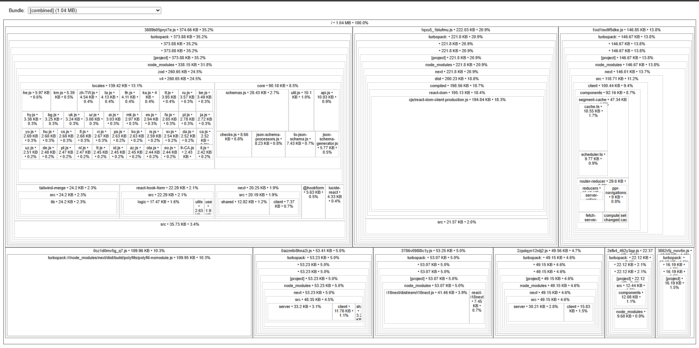

# Atribución del bundle de cliente por librería — 20 agosto 2026

Medición del estado de partida (tarjeta 0.5 de la Fase 0). **Este documento no
propone soluciones**: mide y describe de dónde salen los KB.

- Rama: `chore/bundle-analysis`
- Fecha de ejecución: **2026-08-20**
- Origen del análisis: **build local**, no producción (ver apartado 1)
- Complementa: [`network-2026-08-20.md`](network-2026-08-20.md) · [`lighthouse-2026-08-19.md`](lighthouse-2026-08-19.md) · [`baseline-2026-08-11.md`](baseline-2026-08-11.md)

## Herramientas

| Herramienta | Versión |
|---|---|
| Next.js | 16.2.9 (Turbopack) |
| Node | 24.15.0 |
| `source-map-explorer` | vía `npx`, sin añadirla a `package.json` |

---

## 1. Método, y por qué esta medición es local

### Source maps: qué son y por qué no se publican

Un **source map** es un archivo `.map` que traduce del código minimizado al
original: un diccionario de ida y vuelta. Es lo que permite depurar en DevTools
viendo el código real, y lo que permite a una herramienta decir «estos KB vienen
de tal paquete».

**No se publican** porque permiten reconstruir el código fuente original —
estructura, nombres de variables y comentarios. Next los desactiva por defecto en
producción, y es lo correcto.

### Consecuencia: aquí se mide en local

Los chunks de producción **no llevan `.map`**, así que no se pueden atribuir. El
build se generó en local desde el mismo commit, de modo que la composición del
bundle es la misma; lo único que cambia es dónde se ejecutó el build.

Es la excepción explícita al principio de «medir siempre producción» que rige el
resto de la Fase 0: no se mide un **tiempo**, se mide una **composición**, y la
composición no depende de la máquina.

### El cambio temporal en `next.config.ts`, y su reversión verificada

Para generar los mapas se añadió temporalmente:

```ts
const nextConfig: NextConfig = {
  productionBrowserSourceMaps: true,
};
```

**Ese cambio nunca se commiteó.** Reversión y comprobación, en este orden:

```
$ git checkout next.config.ts
$ git diff next.config.ts        →  (vacío)
$ npm run build                  →  ✓ Compiled successfully, exit 0
$ find .next/static -name "*.map" | wc -l
0
```

`next.config.ts` queda exactamente como estaba.

### Incidencia: `source-map-explorer` frente a Turbopack

El primer intento falló en los 11 chunks con este error:

```
Your source map refers to generated column Infinity on line 1,
but the source only contains 54644 column(s) on that line.
```

Los chunks vienen en una sola línea, así que una posición se indica sólo por
columna. Los mapas de Turbopack apuntan a la columna `Infinity`, un valor
centinela que significa «hasta el final de la línea», y la validación de límites
de `source-map-explorer` lo rechaza. **No es un fallo del proyecto: es un
desacuerdo entre dos herramientas.**

Se resolvió desactivando esa validación:

```bash
npx -y source-map-explorer ".next/static/chunks/*.js" --html bundle-report.html --no-border-checks
```

**Coste de precisión, medido:** 3 513 bytes sin mapear de 976 030 analizados =
**0,36 %**. Los porcentajes de este informe son fiables dentro de ese margen.

Detalle menor: Turbopack no nombra los `.map` como sus `.js`
(`0aizm6r8hna2i.js` → `2lwnvmd5rltdw.js.map`). La herramienta los localiza por el
comentario `//# sourceMappingURL=` del final de cada chunk.

---

## 2. Atribución por paquete

**Total del bundle de cliente: 1 063,1 KB sin comprimir.**

> ⚠️ **Todas las cifras de este informe son SIN COMPRIMIR.** No deben mezclarse
> con los 302,3 KB gzip de la auditoría §1 ni con los 279,3 kB transferidos que
> midió la tarjeta 0.4. Son tres magnitudes distintas de la misma cosa.

| Paquete | KB | % |
|---|---:|---:|
| `next` (framework + React) | 512,7 | **48,2 %** |
| **`zod`** | **260,7** | **24,5 %** |
| código propio + runtime + polyfills | 168,7 | 15,9 % |
| `i18next` | 41,5 | 3,9 % |
| `tailwind-merge` | 24,2 | 2,3 % |
| `react-hook-form` | 22,3 | 2,1 % |
| `react-i18next` | 7,5 | 0,7 % |
| `i18next-browser-languagedetector` | 6,6 | 0,6 % |
| `@hookform/resolvers` | 5,6 | 0,5 % |
| `lucide-react` | 4,3 | 0,4 % |
| *(sin mapear)* | 3,4 | 0,3 % |
| `next-themes` | 3,2 | 0,3 % |
| resto (< 1 KB cada uno) | 2,5 | 0,2 % |

---

## 3. El hallazgo: `zod` es una cuarta parte del bundle

**260,7 KB — el 24,5 % de todo el JavaScript de cliente — para validar un
formulario de tres campos: nombre, email y mensaje.**

### Y más de la mitad de esos KB son idiomas que no usas

El treemap permite abrir el paquete por dentro, y ahí está lo interesante:

| Dentro de `zod` | KB | % del bundle | % de `zod` |
|---|---:|---:|---:|
| **`locales`** | **139,42** | **13,1 %** | **53,5 %** |
| `core` (el motor de validación) | 90,18 | 8,5 % | 34,6 % |
| resto (`schemas`, `checks`, JSON Schema…) | ~31 | ~2,9 % | ~11,9 % |

`locales` son los mensajes de error de `zod` en unos **40 idiomas**: `he`, `km`,
`zh-TW`, `ta`, `th`, `ka`, `lt`, `ru`, `be`, `hy`, `bg`, `uk`, `ur`, `ar`, `mk`,
`es`, `fa`, `pl`, `ja`, `yo`, `hu`, `cs`, `fi`, `vi`, `ps`, `ko`, `is`, `sv`,
`da`, `ca`, `uz`, `de`, `pt`, `nl`, `id`, `az`, `eo`, `fr-CA`, `it`…

**El sitio sirve dos idiomas.** Los otros 38 viajan en cada carga.

> Es el mismo patrón que `flag-icons`, que la auditoría del 11-08 midió en 271
> banderas (32,4 KB, el 44 % del CSS) para renderizar dos. Dos librerías
> distintas, el mismo defecto: **se importa el paquete entero cuando se usa una
> fracción.**

Esto cambia la naturaleza del problema. «`zod` pesa mucho» no es accionable;
«el 53,5 % de `zod` son locales que no se usan» sí lo es.

### Dónde vive

Reparto por chunk:

| Chunk | KB | Contenido principal |
|---|---:|---|
| `3889b05pryr7e.js` | **374,7** | **`zod` 260,7 · código propio 36,5 · `tailwind-merge` 24,2** |
| `1qxu5_1blufmu.js` | 222,0 | `next` 221,8 |
| `1ixd1sw9f5dke.js` | 146,9 | `next` 146,0 |
| `0cz1d0mv5g_q7.js` | 110,0 | polyfills |
| `0aizm6r8hna2i.js` | 53,4 | `next` 53,2 |
| `3786v098l8c1y.js` | 53,2 | `i18next` 41,5 · `react-i18next` 7,5 · `next-themes` 3,2 |
| `2zpdqyn12rdj2.js` | 49,6 | `next` 49,1 |
| `2sfb4_462y3qp.js` | 22,4 | código propio 12,7 · detector de idioma 6,6 |
| `3862r5j_nwv6n.js` | 17,3 | `next` 16,1 |
| `turbopack-…js` | 10,4 | runtime de Turbopack |
| `1udv_cwomyr81.js` | 3,3 | `next` 3,1 |

**`zod` es el 70 % del chunk más grande.** Y ese chunk es exactamente el que la
tarjeta 0.4 midió en producción como **101 kB transferidos**: el archivo más
pesado de toda la página, por encima de todas las imágenes juntas.

*(Los hashes de los nombres difieren de los que sirve producción porque son dos
builds distintos; la correspondencia se establece por tamaño en el apartado 5.)*

---

## 4. Tres observaciones más

### 4.1 `lucide-react` no es un problema: 4,3 KB

La auditoría del 11-08 (§1) contabilizó **176 módulos** de `lucide-react` y lo
listó entre los paquetes grandes del grafo de build. En KB reales son **4,3**, un
0,4 % del bundle. El *tree-shaking* elimina los iconos no usados.

> **Contar módulos no sirve para estimar peso.** Este informe es la prueba: la
> auditoría también contabilizó 624 módulos de `zod` y 1 084 de `flag-icons`, y
> los tres números resultan tener significados completamente distintos —
> `lucide-react` es irrelevante, `zod` es un cuarto del bundle, y `flag-icons` ni
> siquiera aparece aquí porque es CSS, no JavaScript.

### 4.2 Los 110 KB de polyfills no llegan al navegador

El chunk `0cz1d0mv5g_q7.js` son 110,0 KB de polyfills, el 10,3 % del build. La
medición de red del 20-08 confirmó que **Chrome 151 no lo descarga**: en el
waterfall aparecen 9 peticiones de script, no 11.

Está en el build; no está en el cable. Cualquier lectura del bundle que lo
incluya sobrestima lo que recibe un navegador moderno.

### 4.3 El código propio son ~48 KB de 1 063

La categoría «código propio + runtime + polyfills» (168,7 KB) mezcla tres cosas.
Descontando el chunk de polyfills (110,0) y el runtime de Turbopack (10,4), queda
**~48 KB de código de la aplicación**, alrededor del **4,5 %** del bundle.

El 95,5 % restante es framework y librerías.

---

## 5. Contraste con la auditoría del 11-08

La auditoría midió los 10 chunks referenciados por el HTML de `/` y sumó
**1 059,4 KB**. Este análisis cubre los **11 archivos** de `.next/static/chunks/`
y suma **1 063,2 KB**. Los tamaños se corresponden uno a uno:

| Auditoría (11-08) | KB | Este build (20-08) | KB |
|---|---:|---|---:|
| `3-kyd-ctkvmev.js` | 374,6 | `3889b05pryr7e.js` | 374,7 |
| `3peubv2924kx4.js` | 222,0 | `1qxu5_1blufmu.js` | 222,0 |
| `07u_h6i539_wj.js` | 146,8 | `1ixd1sw9f5dke.js` | 146,9 |
| `0cz1d0mv5g_q7.js` | 110,0 | `0cz1d0mv5g_q7.js` | 110,0 |
| `14mrh2-p_w84d.js` | 53,4 | `0aizm6r8hna2i.js` | 53,4 |
| `0i64ppjut-x7c.js` | 53,2 | `3786v098l8c1y.js` | 53,2 |
| `15orcrkp-_9ct.js` | 49,5 | `2zpdqyn12rdj2.js` | 49,6 |
| `0rf23obzcp0nl.js` | 22,3 | `2sfb4_462y3qp.js` | 22,4 |
| `3-5k80pt3ds20.js` | 17,3 | `3862r5j_nwv6n.js` | 17,3 |
| `turbopack-36wsln1gez59f.js` | 10,3 | `turbopack-3p058o9iydlj1.js` | 10,4 |
| — | — | `1udv_cwomyr81.js` | 3,3 |
| **TOTAL** | **1 059,4** | | **1 063,2** |

Dos diferencias, las dos explicadas:

1. **Las décimas de KB** son el comentario `//# sourceMappingURL=…` que este
   build añade al final de cada chunk. Eso cambia también el contenido y, con él,
   el hash del nombre.
2. **El chunk de 3,3 KB sobra** porque la auditoría sólo contó los chunks que el
   HTML de `/` referencia, y este análisis cubre el directorio entero.

**Resuelve el pendiente §14.1 de la auditoría**, que decía: *«No puedo afirmar
cuántos KB exactos aporta cada librería al bundle de cliente sin source maps o un
analizador. Lo dejo como pendiente de medir.»*

---

## 6. Evidencia



Un **treemap** dibuja rectángulos proporcionales al tamaño, así que de un vistazo
se ve quién ocupa más sin leer un solo número.

---

## 7. Lo que NO se ha verificado

1. **Reparto comprimido por paquete.** Todo este informe es sin comprimir. La
   proporción global es de ~3,5:1 (1 063,1 KB sin comprimir frente a 302,3 KB
   gzip según la auditoría §1), pero **cada paquete comprime distinto** y no se
   puede repartir el gzip aplicando esa proporción.
2. **Qué parte de `zod` es realmente alcanzable** en tiempo de ejecución. Se ha
   medido lo que entra en el bundle, no lo que se ejecuta.
3. **Si existe una configuración de `zod` o de importación que reduzca su
   huella.** No se ha investigado; es trabajo de la fase correspondiente.
4. **El 0,36 % sin mapear** queda por definición sin atribuir.
5. **Que el build local sea idéntico al desplegado.** Se ha comprobado la
   correspondencia por tamaño (apartado 5), no por contenido byte a byte. Los
   hashes difieren por el comentario de source map.
6. **El CSS.** `source-map-explorer` analizó los `.js`. El reparto del CSS —donde
   la auditoría situó `flag-icons` en el 44 % de 73,1 KB— sigue como estaba.

---

## 8. Conclusiones

1. **`next` es el 48,2 % del bundle** (512,7 KB). Es el framework y React: el
   suelo del que se parte, no una decisión revisable.

2. **`zod` es el 24,5 % (260,7 KB) y valida un formulario de tres campos.** Es el
   hallazgo de esta tarjeta y el único paquete de la lista cuyo peso es
   desproporcionado respecto a lo que hace.

   **Y el 53,5 % de ese peso —139,42 KB, el 13,1 % del bundle entero— son
   mensajes de error en ~40 idiomas, de los que el sitio usa dos.** Mismo defecto
   que `flag-icons` en el CSS: importar el paquete completo para usar una
   fracción.

3. **`zod` ocupa el 70 % del chunk más grande**, que es a su vez la descarga más
   pesada de la página en producción (101 kB transferidos, tarjeta 0.4).

4. **`lucide-react` son 4,3 KB, no un problema.** Contar módulos no predice peso:
   la auditoría lo situó entre los grandes por número de módulos y en KB es
   irrelevante.

5. **110 KB del build son polyfills que un navegador moderno no descarga.**
   Cualquier cifra de bundle que los incluya está inflada.

6. **El código propio es ~48 KB, el 4,5 % del total.**

**Alcance.** Este informe mide; no arregla. Reducir la huella de `zod`, revisar
el CSS o dividir chunks corresponden a fases posteriores. `next.config.ts` queda
sin modificar y verificado.
