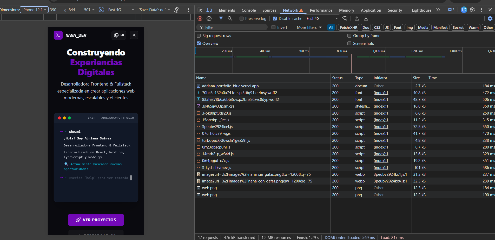

# La red real en producción — 20 agosto 2026

Medición del estado de partida (tarjeta 0.4 de la Fase 0). **Este documento no
propone soluciones**: mide y describe lo que viaja por el cable.

- URL medida: `https://adriana-portfolio-blue.vercel.app`
- Fecha de ejecución: **2026-08-20**, dos mediciones consecutivas en la misma sesión
- Idioma de la interfaz: **español**
- Rama: `docs/network-baseline`
- Complementa: [`lighthouse-2026-08-19.md`](lighthouse-2026-08-19.md) · [`no-js-2026-08-18.md`](no-js-2026-08-18.md) · [`baseline-2026-08-11.md`](baseline-2026-08-11.md)

## Herramientas y condiciones

| | |
|---|---|
| Navegador | Google Chrome 151.0.7922.138, **ventana de incógnito** |
| Panel | DevTools → Network |
| Caché | **Disable cache** activado |
| Red | Throttling **Fast 4G** |
| Recarga | `Ctrl + Shift + R` |

Incógnito para que ninguna extensión ensucie el waterfall — precaución que faltó
en las capturas del 18-08 y que allí se anotó como incidencia.

**Dos mediciones, dos viewports:**

| Medición | Viewport | DPR |
|---|---|---|
| A — tablet | ~730 px CSS, ventana normal | 1 |
| B — móvil | **390 × 844**, emulación iPhone 12 Pro | **3** |

---

## 1. Totales

| | A — tablet | B — móvil 390 px |
|---|---:|---:|
| Peticiones | 17 | 17 |
| **Transferido** | **476 kB** | **476 kB** |
| Recursos (sin comprimir) | 1,2 MB | 1,2 MB |
| Finish | 1,28 s | 1,29 s |
| `DOMContentLoaded` | 622 ms | 569 ms |
| `Load` | 883 ms | 817 ms |

> **El visitante de móvil descarga exactamente lo mismo que el de escritorio.**
> 476 kB, 17 peticiones, byte por byte. No hay ni un solo ahorro por tamaño de
> pantalla.

Transferido frente a recursos: **476 kB viajan y 1,2 MB llegan a memoria**, una
proporción de ~2,5:1. Es la misma distinción que ya se midió sobre el HTML el
18-08 (2 425 bytes por el cable, 9 893 en memoria): *transferred* manda para el
tiempo de carga, *resource size* para lo que la CPU tiene que procesar.

---

## 2. Reparto de los 476 kB

Idéntico en los dos viewports.

| Tipo | Transferido | % |
|---|---:|---:|
| **JavaScript** (9 archivos) | 279,3 kB | **58,7 %** |
| **Fuentes** (2 × `.woff2`) | 89,5 kB | 18,8 % |
| Imágenes del About (2 × WebP) | 63,6 kB | 13,3 % |
| **Favicon `web.png`, descargado ×2** | 24,5 kB | 5,1 % |
| CSS | 16,8 kB | 3,5 % |
| HTML | 2,7 kB | 0,6 % |

Dos lecturas que no se esperaban:

- **Las dos fuentes pesan tanto como todas las imágenes juntas** (89,5 kB frente
  a 88,1 kB contando el favicon). Nadie mira las fuentes cuando busca peso.
- **El favicon es el 5 % de la página.** Ver apartado 5.

---

## 3. Las imágenes: se descargan las dos

```
image?url=%2Fimages%2Fnana_sin_gafas.png&w=…&q=75   webp   31,3 kB
image?url=%2Fimages%2Fnana_con_gafas.png&w=…&q=75   webp   32,3 kB
```

En **los dos** viewports, incluido el móvil de 390 px.

Y una de ellas no se ve. `src/components/sections/About/About.tsx:73`:

```tsx
className="object-cover grayscale … hidden lg:block"
```

`nana_sin_gafas` lleva `hidden lg:block`: por debajo del breakpoint `lg`
(1024 px) tiene `display: none` y **no se pinta ni un píxel de ella**. Se
descarga igual.

> **CSS no impide la descarga.** `hidden` decide qué se pinta, no qué se pide.
> La petición la lanza `next/image` al montarse el componente, y eso ocurre
> antes y con independencia de lo que diga la hoja de estilos.

**Coste medido del desperdicio: 31,3 kB** en cada carga de móvil y tablet, para
una imagen que ese visitante no verá nunca. Ambas llevan además `priority`
(`About.tsx:74` y `:82`), que le pide a Next que las **precargue**.

---

## 4. El `sizes` que falta: un fallo latente, tapado por otro fallo

Ningún `<Image>` del proyecto declara `sizes`. Sin él, Next asume que la imagen
ocupa **el ancho completo de la pantalla** y elige la variante en consecuencia.

Lo que pidió Next en cada medición:

| Medición | Viewport | DPR | Píxeles asumidos | **Variante pedida** |
|---|---:|---:|---:|---:|
| A — tablet | ~730 px | 1 | ~730 | `w=828` |
| B — móvil | 390 px | **3** | 390 × 3 = **1 170** | **`w=1200`** |

**En una pantalla más estrecha, Next pidió una imagen más grande.** No es un
error de Next: es el resultado correcto de una premisa falsa. Multiplica el ancho
de pantalla por la densidad de píxeles y redondea hacia arriba, porque `sizes` no
le ha dicho que el hueco real es mucho más pequeño.

El hueco real en móvil es `w-56` = **224 px CSS** (`About.tsx:67`), o sea 672 px
físicos a DPR 3. Next pidió 1 200.

### La premisa falsa está escrita en el HTML

No hay que deducirla. `priority` hace que Next emita una etiqueta de precarga por
cada imagen, y ahí queda registrada la suposición:

```html
<link rel="preload" as="image" imagesizes="100vw">
<link rel="preload" as="image" imagesizes="100vw">
```

**`imagesizes="100vw"`** es el `sizes` ausente, rellenado por Next con su valor
por defecto: «esta imagen ocupa el ancho completo del viewport». De ahí sale
todo lo demás.

El mismo volcado del DOM muestra que `priority` es lo que fuerza la descarga, y
que no es el comportamiento normal de `next/image`:

| Imagen | `loading` | Motivo |
|---|---|---|
| `nana_sin_gafas` | *(ninguno)* | `priority` desactiva la carga diferida |
| `nana_con_gafas` | *(ninguno)* | `priority` desactiva la carga diferida |
| `adriana_portfolio` | `lazy` | comportamiento por defecto |
| `los_inmaduros_roller_madrid` | `lazy` | comportamiento por defecto |
| `cafe_de_altura` | `lazy` | comportamiento por defecto |

Las tres imágenes de proyectos son diferidas y no aparecen en el waterfall. Las
dos del About no lo son porque el código pide explícitamente que no lo sean.

**Un `preload` se resuelve antes de que el CSS intervenga**: el navegador ya ha
pedido el recurso cuando todavía no ha decidido qué pintar. Por eso `hidden` no
puede impedirlo — no llega a tiempo, y tampoco es su trabajo.

Detalle adicional: el atributo `src` de las dos imágenes apunta a
`?url=…&w=3840&q=75`, la variante más grande que Next genera. Es sólo el
respaldo para navegadores que ignoren `srcset`, pero muestra hasta dónde llega la
suposición de `100vw`.

### Por qué el desperdicio hoy es cero, y por qué eso es una mala noticia

Las dos mediciones devuelven **exactamente los mismos bytes** (31,3 kB y
32,3 kB) pese a pedir variantes distintas. La causa está en el origen:

| Archivo | Dimensiones reales | Peso en `public/` |
|---|---|---:|
| `nana_con_gafas.png` | **768 × 1024** | 1 029,3 KB |
| `nana_sin_gafas.png` | **768 × 1024** | 1 023,3 KB |

**Los originales sólo miden 768 px de ancho.** Next no reescala hacia arriba, así
que tanto la petición de 828 como la de 1 200 devuelven la misma imagen de 768 px.

O sea: **la petición era un 79 % más ancha de lo necesario, y sólo la limitación
del original impidió que se pagara.** Entregar 768 px donde hacían falta 672 es
apenas un 14 % de exceso.

> Es un **fallo latente**. El día que se sustituyan estas fotos por originales de
> más resolución — que es exactamente lo que pide una pantalla retina — el
> desperdicio aparecerá de golpe. Arreglar la resolución de origen **sin** añadir
> `sizes` empeoraría la situación en vez de mejorarla. Los dos cambios van juntos
> o no van.

### Formato

Las variantes se sirven en **WebP, no en AVIF**. Next sólo genera AVIF si se
configura `images.formats`, y `next.config.ts` está vacío. AVIF sería aún más
pequeño.

### Sobre el peso de los originales

1 029 KB para una imagen de 768 × 1024 son ~1,3 bytes por píxel: **PNG es el
formato equivocado para una fotografía**. No afecta al visitante — Next entrega
32 kB en cualquier caso — pero sí al tamaño del repositorio y al trabajo de
transformación en cada caché fría.

Comprobado de paso: **`public/images/avatar.jpg` mide 5 184 × 3 456** (17,9
megapíxeles, 1 169,4 KB) y **no se referencia en ningún sitio**. Es el original
de cámara sin tocar. Confirma la auditoría §9.

---

## 5. El favicon se descarga dos veces

```
web.png   200   png   12,3 kB   184 ms
web.png   200   png   12,2 kB   190 ms
```

Dos peticiones al mismo archivo, en los dos viewports. La causa está en
`src/app/layout.tsx:21-24`:

```tsx
icons: {
  icon: "/web.png",
  shortcut: "/web.png",
}
```

Dos claves distintas apuntando al mismo archivo generan **dos etiquetas `<link>`
distintas**, y el navegador honra las dos.

**24,5 kB — un 5,1 % de la página — para el icono de la pestaña.** Es más de lo
que pesan el CSS y el HTML juntos. Hallazgo nuevo: no estaba en la auditoría del
11-08.

---

## 6. JavaScript

9 peticiones de script, **279,3 kB transferidos**, el 58,7 % de la página.

Contraste con la auditoría §1, que calculó **302,3 KB gzip repartidos en 10
chunks** midiendo el build local:

- **En producción sólo se descargan 9.** El chunk de polyfills
  (`0cz1d0mv5g_q7.js`, 38,5 KB gzip en la auditoría) **no se pide**: Chrome 151
  no lo necesita.
- Los dos números **no son directamente comparables**: la auditoría comprimió los
  archivos localmente con gzip, y aquí se mide lo que Vercel entrega de verdad,
  con su propia compresión. Se anotan los dos sin forzar que cuadren.

El chunk mayor, `3-kyd-ctkvmev.js`, transfiere **101 kB** él solo — más que todas
las imágenes de la página.

---

## 7. Correcciones a la auditoría del 2026-08-11

### 7.1 — §10: el coste de las imágenes es ~33 veces menor de lo que sugería

La auditoría documenta los originales de 1 054 KB y 1 048 KB y advierte de que
About carga «**dos** imágenes de ~1 MB con `priority`». Leído en bruto, sugiere
unos 2 MB de coste.

**Medido: 63,6 kB en total.** `next/image` convierte cada PNG de ~1 MB en un WebP
de ~32 kB, una reducción de unas 33×.

El problema sigue siendo real —se descarga una imagen que no se ve— pero su
tamaño es **31,3 kB, no 1 MB**. Es precisamente por esto por lo que se mide la
red en vez de deducir del peso del archivo en `public/`.

### 7.2 — §14.3: pendiente resuelto

La auditoría dejaba como pendiente el «peso real de las imágenes optimizadas en
producción». Queda medido en el apartado 3.

---

## 8. Evidencia



---

## 9. Lo que NO se ha verificado

1. **Resource size por petición.** Se registraron los totales (476 kB / 1,2 MB)
   pero no la descomposición fila a fila; haría falta activar *Big request rows*.
2. **Segunda carga con caché caliente.** Todo se midió con `Disable cache`, o sea
   el peor caso: primer visitante. Un visitante que vuelve descarga mucho menos.
3. **Redes más lentas que Fast 4G** (3G, 2G) y dispositivos con DPR distinto de
   1 o 3.
4. **Peso de las imágenes de los proyectos.** Las tarjetas de proyecto están más
   abajo en la página y sus imágenes no aparecen en el waterfall: se cargan de
   forma diferida. No se midieron.
5. **Cabecera `Content-Type` exacta de cada imagen.** El tipo se leyó de la
   columna *Type* de DevTools (`webp`), no de las cabeceras de respuesta.
6. **Estado de la caché de Vercel** (`X-Vercel-Cache`) durante estas cargas.

---

## 10. Conclusiones

1. **476 kB y 17 peticiones, idénticos en móvil y en tablet.** El sitio no ahorra
   absolutamente nada por tamaño de pantalla.

2. **El JavaScript es el 58,7 % de todo lo que viaja.** Un solo chunk, 101 kB,
   pesa más que todas las imágenes de la página juntas.

3. **Las dos fotos del About se descargan siempre, y una de ellas nunca se ve
   por debajo de 1 024 px.** 31,3 kB por carga, con `priority` para precargarlas
   antes. Confirmado en los dos viewports.

4. **El `sizes` que falta es un fallo latente, no un fallo activo.** Next pidió
   una variante un 79 % más ancha de la necesaria y sólo se salvó porque los
   originales miden 768 px y no se puede reescalar hacia arriba. **Subir la
   resolución de origen sin añadir `sizes` haría aparecer el desperdicio.**

5. **El favicon se descarga dos veces por una duplicación en `layout.tsx`**, y
   cuesta más que el CSS y el HTML juntos. Hallazgo nuevo.

6. **Las imágenes optimizadas cuestan 33 veces menos de lo que sugería la
   auditoría.** Se corrige el orden de magnitud, no la existencia del problema.

**Alcance.** Este informe mide; no arregla. Comprimir imágenes, añadir `sizes`,
retirar `priority` de la foto oculta y deduplicar el favicon corresponden a la
fase de rendimiento.
