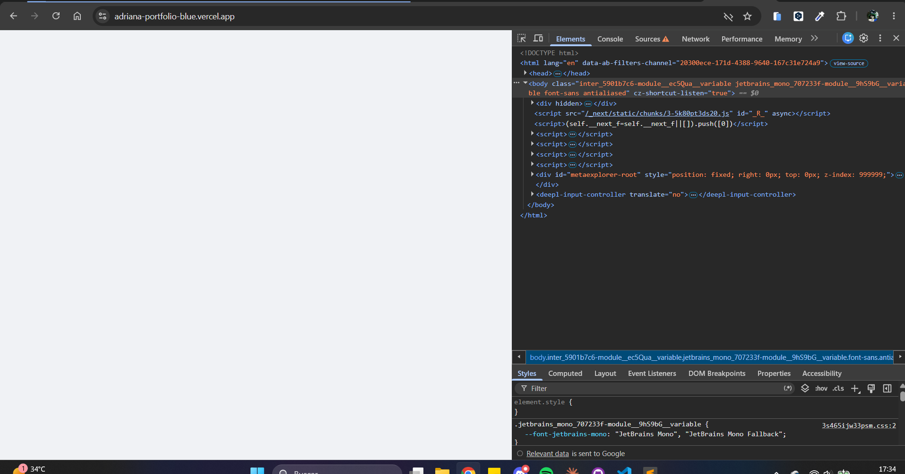
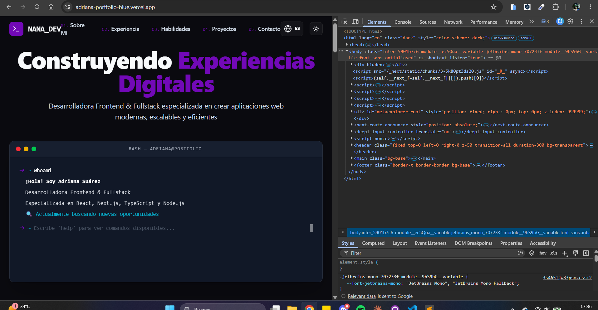

# Vista sin JavaScript y como la ve un crawler — 18 agosto 2026

Medición del estado de partida (tarjeta 0.3 de la Fase 0). **Este documento no
propone soluciones**: mide y describe lo que produce hoy el sitio en producción.

- URL medida: `https://adriana-portfolio-blue.vercel.app`
- Fecha y hora de ejecución: **2026-08-18, 14:24 GMT** (capturas a las 17:34-17:36 hora local)
- Rama: `docs/no-js-baseline`
- Origen del contraste: [`baseline-2026-08-11.md`](baseline-2026-08-11.md)

## Herramientas y versiones

| Herramienta | Versión |
|---|---|
| curl | 8.21.0 (Windows) · libcurl/8.21.0 · Schannel · zlib/1.3.2 |
| Google Chrome | 151.0.7922.138 |
| DevTools | el que incluye Chrome 151 |

## Método

1. Descarga del HTML crudo de producción con `curl` (no ejecuta JavaScript).
2. Volcado de las cabeceras de respuesta con `curl -sS -I`.
3. Inspección del `<body>` servido y recuento de scripts y de apariciones del nombre.
4. Medición del peso transferido con compresión negociada a mano.
5. Carga de producción en Chrome con **JavaScript desactivado** desde DevTools
   (`Ctrl+Shift+P` → *Disable JavaScript*), recarga y captura.
6. Segunda captura con JavaScript activado, para contraste.

Todo número de este documento procede de una de esas ejecuciones.

---

## 1. Cabeceras de producción

```
$ curl -sS -I https://adriana-portfolio-blue.vercel.app
HTTP/1.1 200 OK
Accept-Ranges: bytes
Access-Control-Allow-Origin: *
Age: 1182678
Cache-Control: public, max-age=0, must-revalidate
Content-Disposition: inline
Content-Length: 9893
Content-Type: text/html; charset=utf-8
Date: Tue, 18 Aug 2026 14:24:07 GMT
Etag: "86442c3413547d968327d904380f613d"
Server: Vercel
Strict-Transport-Security: max-age=63072000; includeSubDomains; preload
Vary: rsc, next-router-state-tree, next-router-prefetch, next-router-segment-prefetch
X-Matched-Path: /
X-Nextjs-Prerender: 1
X-Nextjs-Stale-Time: 300
X-Vercel-Cache: HIT
X-Vercel-Id: cdg1::znpqq-1787063047653-03914975d7ff
```

### Las tres que importan

| Cabecera | Valor | Lectura |
|---|---|---|
| `Content-Length` | `9893` | Tamaño del HTML sin comprimir. Coincide con lo medido el 11-08. |
| `X-Nextjs-Prerender` | `1` | Next declara que la ruta se prerenderizó en tiempo de build. Y es cierto: prerenderizó un documento sin contenido. |
| `X-Vercel-Cache` | `HIT` | Servido desde el CDN, sin llegar al origen. |

`X-Nextjs-Prerender: 1` resume el problema. El prerenderizado **funciona**; lo que
no hay es nada que prerenderizar, porque `I18nProvider` devuelve `null` en el
render de servidor (`src/components/providers/I18nProvider.tsx:25-27`).

### El artefacto medido es el mismo que el del 11-08

`Age: 1182678` son los segundos que la respuesta llevaba en la caché del CDN:
**13 días, 16 h y 31 min**. Restados a `Date` (18 ago 14:24:07 GMT), la copia
almacenada data de **~4 ago 2026, 21:53 GMT**.

Consecuencia metodológica: entre la auditoría del 11 de agosto y esta medición
no ha habido despliegue. **Las dos describen el mismo build**, así que son
comparables sin reservas.

> Matiz: `Age` es la edad del objeto en caché, no la fecha del despliegue.
> Coinciden casi siempre, pero no son lo mismo por definición.

### Cabeceras de seguridad

Verificado hoy, 7 días después de la auditoría. Sin cambios:

| Cabecera | Estado |
|---|---|
| `Strict-Transport-Security` | ✅ presente — es el valor por defecto de Vercel, no configuración propia |
| `Content-Security-Policy` | ❌ ausente |
| `X-Frame-Options` | ❌ ausente |
| `X-Content-Type-Options` | ❌ ausente |
| `Referrer-Policy` | ❌ ausente |
| `Permissions-Policy` | ❌ ausente |
| `Access-Control-Allow-Origin` | ⚠️ `*` sobre el HTML |

Confirma el punto 3 de los *known issues*. Fuera del alcance de la Fase 0.

---

## 2. El `<body>` que se sirve

Descargado con `curl -s ... -o home-raw.html`. Tamaño verificado en disco:

```
$ wc -c home-raw.html
9893 home-raw.html
```

Coincide con `Content-Length`, así que la descarga está completa.

Comienzo literal del cuerpo:

```html
<body class="inter_5901b7c6-module__ec5Qua__variable jetbrains_mono_707233f-module__9hS9bG__variable font-sans antialiased"><div hidden=""><!--$--><!--/$--></div><script src="/_next/static/chunks/3-5k80pt3ds20.js" id="_R_" async=""></script><script>(self.__next_f=self.__next_f||[]).push([0])</script><script>self.__next_f.push([1,"1:\"$Sreact.
```

| Medición | Valor |
|---|---:|
| Etiquetas `<script>` en el documento | **15** |
| Elementos del `<body>` que no son `<script>` | **1** (`<div hidden="">`) |
| Caracteres de texto visible en el `<body>` | **0** |

`hidden` es un atributo estándar de HTML: el navegador no pinta ese elemento.
Y dentro sólo hay dos comentarios, `<!--$-->` y `<!--/$-->`, que son los
marcadores con los que React delimita una región de Suspense en el HTML de
servidor. Entre el marcador de apertura y el de cierre va el contenido
renderizado.

**Aquí, entre ellos, no hay nada.** El render de servidor abrió la región,
`I18nProvider` devolvió `null`, y la cerró vacía.

---

## 3. Peso real por el cable

`curl` no pide compresión por defecto, así que los 9 893 bytes de `Content-Length`
son el HTML **sin comprimir**. Pidiéndola explícitamente y guardando los bytes tal
como viajaron:

```
$ curl -s -H 'Accept-Encoding: br, gzip' https://adriana-portfolio-blue.vercel.app -o home-encoded.bin
$ wc -c home-encoded.bin
2425 home-encoded.bin
```

| Medida | Bytes |
|---|---:|
| HTML sin comprimir | 9 893 |
| HTML transferido con compresión | **2 425** |
| Proporción | 24,5 % (≈ 4,1:1) |

Nota metodológica: `curl -sS -I --compressed` **no** sirve para esto. Al ser una
petición `HEAD` no hay cuerpo que comprimir, y Vercel devuelve el mismo
`Content-Length: 9893` sin `Content-Encoding`. La compresión sólo se negocia de
verdad en un `GET`.

### El contraste que importa

La auditoría del 11-08 (§1) midió el First Load JS en **302,3 KB gzip**
(1 059,4 KB sin comprimir).

> El HTML llega en 2,4 KB y está vacío. El contenido vive en unas **125 veces
> más bytes** de JavaScript que además hay que descargar **y ejecutar** antes de
> que aparezca una sola palabra.

No hay un problema de HTML pesado. Hay un HTML ligerísimo que no dice nada y todo
el peso desplazado a un sitio donde el crawler no llega y el visitante espera.

---

## 4. Qué encuentra un buscador en el HTML

Búsqueda del nombre en el documento servido:

```
$ grep -o 'Adriana Suárez' home-raw.html | wc -l
2
```

Contexto de cada aparición:

| # | Dónde | ¿HTML indexable? |
|---|---|---|
| 1 | `<title>Adriana Suárez \| Frontend &amp; Fullstack Developer</title>` | ✅ Sí |
| 2 | Payload RSC inline: `14:[["$","title","0",{"children":"Adriana Suárez \| ..."}]` | ❌ No — es una cadena dentro de un `<script>` |

Y la meta description:

```html
<meta name="description" content="Portfolio showcasing frontend and fullstack development projects with React, Next.js, TypeScript, and Node.js"/>
```

**No contiene el nombre.**

> **Conclusión:** «Adriana Suárez» aparece **una sola vez** en el HTML indexable
> de todo el portfolio — en el `<title>`. En el cuerpo, cero. En la descripción,
> cero.

---

## 5. Correcciones a la auditoría del 2026-08-11

Dos afirmaciones de la auditoría no resisten la verificación directa. Se corrigen
aquí en vez de editarlas allí, para que el registro conserve qué se creyó y
cuándo se comprobó.

### 5.1 — §5: dónde están las 2 apariciones del nombre

La auditoría afirma que están en `<title>` y en `<meta name="description">`.
**Es incorrecto.** Verificado sobre el HTML de producción el 2026-08-18: la
segunda está en el payload RSC inline, no en una etiqueta del `<head>`, y la meta
description no contiene la cadena.

El matiz cambia la conclusión: el nombre aparece **1 vez** en HTML indexable, no 2.

### 5.2 — §2: «idéntico byte a byte»

La auditoría mide **9 891 bytes** en el build local y **9 893** en producción, y
describe la coincidencia como byte a byte. Son **2 bytes de diferencia**. No
altera ninguna conclusión, pero la redacción correcta es «coincide salvo 2 bytes».

---

## 6. Evidencia visual

### Producción con JavaScript desactivado



Chrome 151, DevTools abierto, *Disable JavaScript* activo (visible en el ⚠️ de la
pestaña **Sources**), recarga con `Ctrl+R`. El área de la página está
**completamente en blanco**, y el DOM contiene únicamente `<div hidden>` y los
`<script>`. **No existen `<header>`, `<main>` ni `<footer>`.**

### La misma URL con JavaScript activado



Aparecen `<header>`, `<main>` y `<footer>` en el DOM, y en pantalla el hero, la
navegación y la terminal.

**Dos hallazgos extra que enseña esta captura:**

1. **`<html lang="en">` con la interfaz en español.** En la barra de navegación se
   lee «Sobre Mí», «Experiencia», «Habilidades», «Proyectos», «Contacto», y el
   selector marca `ES` — mientras el documento sigue declarando inglés. Confirma
   visualmente el punto 4 de los *known issues*.
2. **`class="dark"` y `style="color-scheme: dark"` sólo aparecen con JS activado.**
   El tema también depende de que el JavaScript se ejecute.

---

## 7. Lo que NO se ha verificado

En honor a no suponer nada:

1. **Qué codificación usó Vercel** en la respuesta comprimida (`br` o `gzip`). Se
   midieron los bytes transferidos, no se registró el `Content-Encoding`.
2. **Comportamiento con un crawler real** (Googlebot, Bingbot). Lo medido es lo
   que recibe un cliente HTTP sin motor de JavaScript, que es el mismo insumo,
   pero no se ha ejecutado ninguna herramienta de inspección de buscador.
3. **Vista previa real al compartir el enlace** en LinkedIn, WhatsApp o Twitter.
   Se infiere de la ausencia de Open Graph (auditoría §6), no se ha probado.
4. **Limpieza del DOM capturado.** Las capturas se tomaron en una ventana normal,
   no de incógnito. En el DOM se ven nodos inyectados por extensiones del
   navegador (`<div id="metaexplorer-root">`, `<deepl-input-controller>`) que **no
   pertenecen a la aplicación**. No afectan a las conclusiones, porque lo que se
   afirma es la *ausencia* de contenido propio, pero conviene saberlo. Las
   mediciones de red (tarjeta 0.4) se harán en incógnito por este motivo.

---

## 8. Conclusiones

1. **El HTML que sirve producción no contiene contenido.** 0 caracteres de texto
   visible en el `<body>`; un único elemento no-script, marcado `hidden`.
   Verificado con `curl` y confirmado visualmente en Chrome sin JavaScript.

2. **Para el SEO, el portfolio es un `<title>`.** Un crawler que no ejecute
   JavaScript encuentra el nombre una vez, en la etiqueta de título, y nada más.
   Sin Open Graph ni JSON-LD (auditoría §6), una vista previa de enlace en
   LinkedIn o WhatsApp no tiene material del que tirar.

3. **Para el LCP, el reloj no arranca hasta el final de la cadena.** El elemento
   más grande de la pantalla no puede pintarse hasta que se descargan ~302 KB
   gzip de JavaScript, se ejecutan, e i18next termina de inicializarse en el
   cliente. El HTML llega en 2,4 KB y no adelanta absolutamente nada.

4. **Para quien navega sin JavaScript, el sitio no existe.** No hay degradación
   parcial: hay una página en blanco.

**Alcance.** Este informe mide; no arregla. La causa está identificada
(`I18nProvider` devolviendo `null` en servidor) y su corrección corresponde a la
Fase 2. Tocarla hoy destruiría el punto de comparación que este documento existe
para conservar.
